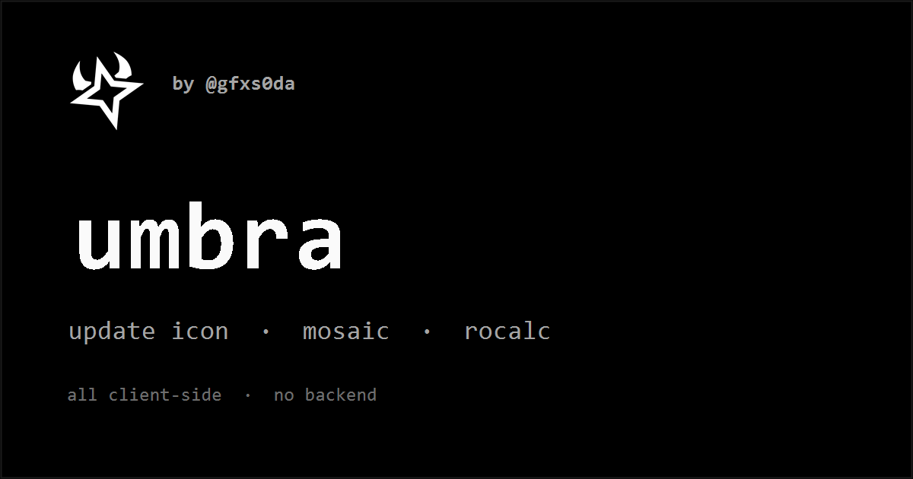

<div align="center">



# umbra

**a roblox gfx utility hub — by [@gfxs0da](https://x.com/gfxs0da)**

five client-side tools for roblox icon & thumbnail work, under one roof.
no backend · no build step · no tracking — everything runs in your browser.

[**→ open umbra**](https://useumbra.cc/)

</div>

---

## the tools

### ⧗ update icon
countdown-overlay generator for roblox game icons — the white hourglass + bold countdown text over a darkened background.

- **unlimited** uploads — drag, paste (`ctrl+v`) or click
- **auto icon** — non-square uploads are cropped to 1:1 automatically; drag the preview to move the crop (double-click recenters)
- **custom overlay** — swap the hourglass for your own png / svg / webp (same size, position and outline controls; remembered)
- live global style: bg darkness, overlay size/position, text size/position, black outline + width
- per-icon editable countdown text
- one-click **generate countdown set** — turns one image into the whole sequence (`24 hours → 12 → … → now!`)
- per-icon duplicate · copy to clipboard · download png at native resolution · **→ frontpage** (preview it on the mock front page)
- receives icons from **crop** (`→ update icon`) — they land as new cards, like a dropped image
- **download all** as separate pngs or as one **.zip** (built-in zip writer, no cdn), with an optional filename prefix — the format is remembered
- **save to** your downloads, or straight into a **folder you pick** (chrome · edge · opera — remembered; never overwrites, repeats become `_2`, `_3`…). the per-icon download always saves one png, to the same place
- saveable style presets · processed locally for privacy

### ▦ mosaic
roblox-style thumbnail grid generator.

- 5 formats (`2×2 … 4×3`), 3 ratios (`16:9 / 1:1 / 4:5`), gap + rounded corners
- drag / drop / paste, drag-to-reorder, per-slot upload
- filters (saturation · contrast · vignette) — applied in preview **and** export
- auto-arrange by engagement, presets, undo/redo (40 steps)
- **boards** — save a whole finished mosaic (grid, settings **and** images) and reload it later to keep editing
- send any slot to **frontpage** to see it among real games
- png export at 1080p / 2k / 4k · remembers your work (indexeddb)

### ∑ rocalc
robux calculator suite.

- **tax** (30%, bi-directional) · **gamepass** reverse pricing
- **devex** (robux ↔ usd ↔ brl, precision mode)
- **black market** — one block with a **currency dropdown** (24 currencies: usd, brl, eur, gbp, jpy, …) — click the code pill or the symbol to switch; price remembered per currency, compared vs the official devex rate
- live exchange rates (open.er-api.com) cached, with dated fallbacks + manual usd→brl override

### ⌂ frontpage
see your thumbnail where it actually lives — on a roblox-style front page, next to today's real games.

- three pages: **home** (recommended · continue · connections), **search** (`results for "<your game>"`) and **charts** (one row per roblox sort)
- **whole screen** (default) — the full 1920×1080 desktop page (or the whole phone) scaled to fit the preview, like a real monitor; **100%** shows it at actual size and you scroll inside it
- **desktop / mobile**, **dark / light**, **en / pt-br**, sidebar on/off, cozy / compact density
- **a/b variants** — up to 4 thumbnails; flip through them in one slot (`←` / `→`) or spread them across the page
- **readability tests** — distance (scale down), squint (blur), grayscale
- **stand-out meter** — saturation · contrast · brightness · colorfulness · detail vs the visible neighbors, with a score + verdict
- **icon** — **upload icon**, or **crop from thumbnail →** sends the active variant's thumbnail to **crop** and the square you pick comes back as the icon. until you set one, tiles use a center square crop of each thumbnail (`remove` goes back to it)
- pick your slot by clicking any tile, filter neighbors by genre, reshuffle them
- **export** the preview as png (1x / 2x) or copy it to the clipboard — in whole screen mode that is the full 1920×1080 screen (3840×2160 at 2x)
- receives icons from update icon and crop, thumbnails from mosaic and crop (16:9) · remembers your work (indexeddb)

### ⛶ crop
a photoshop-style crop for thumbnails and icons. drop, paste or pick an image, and the crop area shows
up highlighted (1:1 by default, the largest square that fits, centred). drag it to move it and drag the
white corners or edge bars to resize it. **alt** resizes from the centre, **shift** keeps the ratio in
`free` mode, the arrow keys nudge it (shift moves 10 px), **esc** or a double-click resets it and
**enter** downloads it.

- ratios: `1:1 square` · `16:9 thumbnail` · `4:3` · `free` · `original`, plus ⇄ for 9:16 / 3:4
- output: `150` / `512` / `1024` icons, `1280×720` / `1920×1080` thumbnails, `1024×768`, or `native`
  (big downscales use stepwise halving, so a 1080 → 150 icon stays clean). the panel warns when the
  output is upscaled.
- export: download png (repeats get `_2`, `_3`), copy to the clipboard, or send the crop to
  **update icon** or **frontpage** (16:9 goes in as the thumbnail, everything else as the icon)
- frontpage's **crop from thumbnail →** opens its thumbnail here as a 1:1 icon crop
- the ratio and output size are remembered. the image never leaves the browser and is not stored.

---

## design
dark, near-black, monochrome. [jetbrains mono](https://www.jetbrains.com/lp/mono/) throughout, lowercase-leaning ui, glassmorphism panels, a subtle film-grain + ambient particles. respects `prefers-reduced-motion`.

## shortcuts
`1` … `5` switch tools · `←` `→` cycle a/b variants (frontpage) · `ctrl+v` paste images · `ctrl+z` / `ctrl+shift+z` undo / redo (mosaic) · `←↑→↓` nudge · `enter` download · `esc` reset (crop)

## tech
vanilla **html / css / js**. zero build, zero dependencies. all image work is native `<canvas>` (the frontpage export uses a small built-in dom → canvas painter). runs straight from `file://` or any static host — frontpage exports work best over http (github pages or a local server), since browsers block reading local files back from a canvas.

```
index.html        # the whole app shell + the five tool panels
css/              # core design system + one file per tool
js/               # hub controller + one module per tool + feed / helpers
assets/           # logo, favicon, og card, hourglass glyph, frontpage avatars
scripts/          # node scripts that refresh the frontpage data
.github/workflows # the daily feed update
```

## frontpage feed
the neighbor games come from `js/feed.js` — a snapshot of roblox's explore sorts (names, creators, ratings, players, thumbnails, icons).
a github action (`.github/workflows/update-feed.yml`) runs `node scripts/fetch-feed.js` once a day and commits the file only when it changed, so the front page stays current without a backend. the images are hotlinked from the roblox cdn (`tr.rbxcdn.com`), nothing is re-hosted.
refresh it by hand with `node scripts/fetch-feed.js` (`--dry` to check without writing). the action needs *settings → actions → workflow permissions → read and write*.

## run locally
just open `index.html`, or serve the folder:

```sh
npx serve        # or:  python -m http.server
```

## credits
built by [@gfxs0da](https://x.com/gfxs0da) · [github @dgolaus](https://github.com/dgolaus)

not affiliated with roblox corporation. robux, devex and related marks belong to roblox. game names and thumbnails shown in frontpage belong to their creators.
